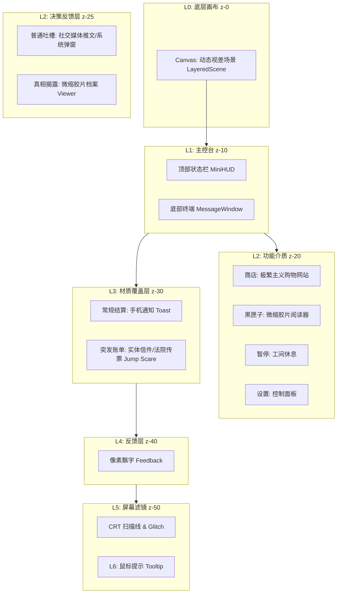

# 📑 美式灵视 UI 设计母盘 (Ver 8.0 Material Edition)

> **版本信息**：Ver 8.0 (Material / Digital Archaeology)
> **设计核心**：**“真实美国的像素世界” (Pixelated Dystopia)**
> **核心隐喻**：玩家是一个润美人，通过第一人称视角，在美国的大街小巷中穿梭。UI 是覆盖在残酷现实之上的一层“消费主义糖衣”。随着玩家精神状态（SAN值）的崩坏，这层糖衣会逐渐剥落，露出底层的异化代码与历史血泪。

---

## 1. 核心 UI 架构图 (Master UI Flowchart)

采用严格的 Z-Index 层级管理，模拟“物理堆叠”的感觉。

---

## 2. 全量 UI 组件清单 (Component Manifest)

| 层级 | 组件名 | Z-Index | 视觉隐喻 (Metaphor) | 关键交互 |
| --- | --- | --- | --- | --- |
| **L6** | **TooltipLayer** | 60 | **Debug 浮窗**：简约白色气泡。 | 跟随鼠标，解释专有名词。 |
| **L5** | **GlobalAtmosphere** | 50 | **旧显示器玻璃**：扫描线、暗角、低 SAN 时的色彩信号失真。 | 穿透点击，全屏覆盖。 |
| **L4** | **FeedbackLayer** | 40 | **街机得分**：粗像素字体，高对比度，伴随“跳动”动画。 | 数值变动时触发。 |
| **L3** | **BillOverlay** | 30 | **实体传票**：皱巴巴的纸张纹理，红色印章，突脸弹出。 | **阻断式**，必须处理才能继续。 |
| **L3** | **RoutineToast** | 30 | **手机通知**：Apple Wallet 风格通知。 | **非阻断**，自动消失。 |
| **L2** | **RoastModal** | 25 | **社交媒体吐槽**：推文/Yelp评论/短信。 | **非阻断**，自动消失。 |
| **L2** | **ShopModal** | 20 | **消费主义陷阱**：拉斯维加斯赌场风格。 | 窗口化操作，模拟轻奢风购物网站。 |
| **L2** | **BlackBox** | 20 | **微缩胶片**：青冷色背光，噪点极高，黑白高反差照片。 | 点击查看详情，伴随机械音效。 |
| **L1** | **MessageWindow** | 10 | **智能手机终端**：iPhone iMessage 风格，作为玩家与世界的接口。 | 底部常驻，核心决策区。 |
| **L1** | **MiniHUD** | 10 | **实物化风格**：顶部悬浮，显示 HP/SAN/金钱。 | 实物化数值展示。 |
| **L1** | **LayeredScene** | 0 | **记忆回溯**：PC98 风格插画，三层视差 (背景/事件/玩家)。伴随事件的不同，背景/事件的插图都不一样。 | 呼吸动画，随 SAN 值崩坏。 |
| **L0** | **AppContainer** | - | **外壳**：负责整体背景色和字体定义。 | - |

---

## 3. 核心视觉设计语言 (Design Language)

### 3.1 风格定义：Pixelated Dystopia (像素废土)

* **整体基调**：**PC98 复古像素（背景）** vs **高清矢量扁平（UI）**。
* **冲突美学**：用精致、圆润、高饱和度的苹果/Ins风 UI（象征消费主义的谎言），强行覆盖在粗糙、抖动、阴暗的像素街景（象征残酷的现实）之上。
* **异化滤镜**：随着 SAN 值降低，UI 会从“商业精修”逐渐剥落，露出底下的“工业锈迹”和“代码乱码”。

### 3.2 色彩体系 (Color Palette)

* **Phase 1: 蓝药丸 (SAN 71-100)**
* *风格*：Instagram 网红风，高饱和，明亮，充满希望的假象。
* *主色*：`#007AFF` (Apple Blue), `#FFFFFF` (纯白), `#F2F2F7` (高级灰).
* *辅助色*：`#34C759` (股市涨), `#FF2D55` (促销红).

* **Phase 2: 裂痕 (SAN 31-70)**
* *风格*：写实灰暗，类似《被嫌弃的松子》或 80 年代纽约地铁。
* *主色*：`#4A4A4A` (水泥灰), `#C0B283` (旧纸张), `#8B0000` (干涸血迹).
* *辅助色*：`#FFD700` (暗金 - 只有钱是亮的).

* **Phase 3: 古神 (SAN 0-30)**
* *风格*：赛博故障 (Glitch) + 克苏鲁，高对比度，荧光色。
* *主色*：`#000000` (虚无黑), `#00FF41` (黑客帝国绿), `#FF00FF` (故障紫).
* *UI 表现*：边框溶解，文字出现乱码。

---

## 4. 详细界面规范 (Detailed Specifications)

### [L0] 底层画布 (LayeredScene) [Z-0]

* **视觉风格**：**PC98 / 16-bit 像素画**。
* **视差设计**：
* **远景**：根据每日事件变化，例：美国地标（自由女神、帝国大厦、好莱坞标志）。SAN 低时，女神像脸部会变成骷髅或条形码。
* **中景**：根据每日事件变化，例：街道。充满细节（流浪汉帐篷、星巴克招牌、警车）。
* **近景**：根据玩家阶级变化，例：流浪汉、工人。

* **交互**：鼠标移动时，背景有轻微的视差偏移（Parallax），模拟第一人称的眩晕感。

### [L1] 主控台 (HUD) [Z-10]

#### A. 顶部状态栏 (MiniHUD)

* **HP**：心电图监视器（绿波纹 -> 红直线）。
* **SAN**：一个眼球图标。SAN 高时睁开，SAN 低时布满血丝并疯狂转动。
* **GOLD**：一个真皮钱包。钱少时干瘪，钱多时鼓胀甚至有金币溢出特效。
* **交互**：
* 鼠标悬停在图标上，显示精确数值。
* 数值下降时，图标会剧烈震动并变红（受击反馈）。

#### B. 底部终端 (MessageWindow)

* **视觉隐喻**：**智能手机聊天界面 (iPhone iMessage)**。
* **外框**：带有圆角的手机屏幕边框。
* **样式**：在右下方，占比 2/3，模拟 iPhone 聊天界面。
* **文本气泡**：
* **系统/事件描述**：左侧气泡（灰色），代表外部世界的输入。
* **玩家选项 (A/B/C)**：右侧气泡（蓝色/绿色），代表玩家的回应。

* **D 选项 (觉醒锁)**：
* *正常*：隐藏或灰色不可点。
* *解锁*：深红色/故障风气泡，字体为 **Serif (衬线体)**，与其他选项的 **Sans-serif (无衬线体)** 形成对比，以此暗示“历史的厚重感”。

### [L2] 功能窗口 (Windows) [Z-20]

#### A. 商店 (The Shop)

* **视觉隐喻**：**极繁主义 (Maximalism) 电商网站 / 拉斯维加斯赌场**。
* **UI 元素**：
* 金色的边框，闪烁的霓虹灯效果。
* 商品卡片像亚马逊页面，有伪造的“5星好评”和“仅剩1件”标签。
* **购买按钮**：巨大的、鲜艳的金色按钮，点击时有“收银机开箱”的清脆音效 `Ka-ching!`。

* **深层商店 (Dark Web)**：
* 当切换到深层商店，UI 瞬间反转：背景变黑，文字变成绿色 Terminal 字体，商品图片变成低分辨率的监控截图。

#### B. 黑匣子 (Archive)

* **视觉隐喻**：**微缩胶片阅读器 (Microfilm Viewer)**。
* **UI 元素**：
* 背景是发着冷光的磨砂玻璃。
* 文字内容呈现为“机密文件”样式，有黑色的涂抹痕迹（Redacted）。
* 图片是黑白高噪点的历史照片。

* **交互**：翻页时有老式机器的马达转动声。

#### [L2] 决策反馈层 (Decision Feedback) [Z-25]
此层级在玩家点击 A/B/C/D 选项后立即触发，覆盖在场景之上，必须交互关闭后，才会触发 L3 的资源结算动画。
A. 普通吐槽弹窗 (The Roast Modal) - 触发 A/B/C 选项
* 定位：轻量级、讽刺、消费主义风格。
* 视觉隐喻：“社交媒体通知 / 系统弹窗”。
* UI 构成：
    * 容器：样式随机，模拟真实的 App 通知。
        * 样式 1 (Twitter/X)：一张带有头像和蓝 V 认证的推文卡片。
        * 样式 2 (Yelp/Google Maps)：一个带星级的地点评论卡片。
        * 样式 3 (System Alert)：iOS 风格的系统弹窗 "System Notification"。
    * 内容：
        * 头像：随机生成的像素路人或系统图标。
        * 文案：对应剧情的吐槽（Flavor Text）。例如：“你花 $8 买了咖啡。你的胰岛素感谢你，但你的钱包报了警。”
        * 配图：一张低像素的表情包或相关物品图（可选）。
* 动效：
    * Pop In (弹性弹出) 或 Slide Down (顶部滑下)。
    * 伴随音效：Ding! (通知声) 或 Vibrate (震动声)。
    
* 交互：点击屏幕任意位置，卡片像被“划走”一样消失，随即触发 L3 的结算动画。
B. 隐秘档案展示 (The Archive Viewer) - 触发 D 选项
* 定位：重量级、严肃、历史真相。
* 视觉隐喻：“微缩胶片阅读器 (Microfilm Viewer) / 报纸”。
* UI 构成：
    * 容器：全屏变暗，中央出现一个发着冷光（青色/冷白）的磨砂玻璃视窗。
    * 档案头图：一张黑白、高噪点、仿佛复印了多次的历史照片（如塔斯基吉梅毒实验的照片）。
    * 档案文本：
        * 字体：Courier New 或打字机字体。
        * 特效：部分文字有黑色的涂抹痕迹 (Redacted)，只有关键信息可见。
        * 印章：右上角有 "TOP SECRET" 或 "EYES ONLY" 的水印。
* 动效：
    * 入场：屏幕先黑屏 0.2s，然后伴随 Hummm (电机启动声) 和 Click-Clack (胶卷卡位声)，画面亮起。
    * 氛围：画面上有持续的噪点和胶片划痕在跳动。
* 交互：
    * 底部有一个红色的 [ARCHIVE] (归档) 按钮。
    * 点击后，伴随一声沉重的盖章声 Thump!，档案被盖上 "TRUTH" 印章并缩小吸入下方的“黑匣子”图标中。
    * 随即触发 L3 的结算动画。
    
### [L3] 结算系统的双轨制设计 (Dual Settlement) [Z-30]

这是区分“日常”与“灾难”的关键设计。

#### A. 常规日常结算 (Routine - The Flow)

* **定位**：预期内、流畅。
* **视觉隐喻**：**“手机银行/电子钱包系统通知”**。
* **UI 构成**：
* **位置**：屏幕正上方半透明毛玻璃气泡。
* **样式**：
* *高 SAN*：半透明毛玻璃 (Glassmorphism)，圆角矩形，白色字体，图标精美。
* *低 SAN*：玻璃碎裂纹理，边缘有锯齿，字体变成绿色终端字体。

* **动效**：`Slide In` -> `Hold 1.5s` -> `Fade Out`。
* **反馈**：
* **Gold**：金色数字滚动 `+$100` (音效: *Cha-Ching*) / 黑色数字 `-$5` (音效: *Beep*)。
* **HP**：红色数字滚动 `-5`。
* **SAN**：紫色数字滚动 `-5`/`+5`。

* **交互**：**无阻断**。玩家不需要点击确认，类似手机通知会自动消失，不影响下一回合操作。

#### B. 突发账单事件 (Surprise - The Jump Scare)

* **定位**：低频、恶意、强制阻断。这是游戏对玩家的“攻击”/“奖励”。
* **视觉隐喻**：**“实体催债信 / 法院传票 / 彩票”，根据类型展示**。
* **UI 构成**：
* **位置**：屏幕正中央 (Modal)，四周背景变暗模糊（压迫感）。
* **样式**：
* **突脸 (Pop-up)**：伴随重物砸桌巨响 *Thud!*，屏幕剧烈震动。
* **材质**：皱巴巴的再生纸，甚至带有咖啡渍。
* **排版**：传统的信函格式，左上角是机构LOGO（如 IRS, Hospital），右下角是鲜红的 "FINAL NOTICE" 或 "OVERDUE" 印章。
* **金额**：巨大的红色粗体数字，例如 `-$2,000`。

* **交互**：**强制阻断**。
* 屏幕其他区域不可点击。
* **支付按钮**：不是普通的按钮，而是一个需要长按的“签字/指纹”区域。
* **没钱时**：如果余额不足，信纸上会出现“REJECTED”水印，玩家只能选择底部的“申请高利贷 / 卖身”小字链接。

### [System UI] 系统菜单 (Menu System)

#### A. 游戏开始 (Start Menu)

* **设计意图**：给玩家展示一个极其美好、梦幻的假象，然后在细节处暗示崩坏。
* **概念**：“美国梦的橱窗”。
* **背景**：动态像素全景——绝美的日落大道 (Sunset Blvd) 或 曼哈顿天际线。霓虹灯闪烁，车流不息。
* **细节彩蛋**：鼠标滑过某些精美的广告牌时，广告牌会瞬间闪烁变成“OBEY”或骷髅头（类似电影《极度空间》）。
* **标题 (Logo)**：
* **主标题**：*American Insight*。字体采用高大上的时尚杂志衬线体 (Vogue 风格)。
* **副标题**：*异化生存*。使用红色手写体涂鸦在主标题上方。

* **菜单选项** (实体物品化)：
* **开始游戏**：桌上的一张绿卡 (Green Card) 或 入职Offer。
* **继续游戏**：一张打卡机工牌 (ID Card)。
* **设置**：一本写着“Employee Handbook” (员工手册) 的册子。
* **退出**：一张揉成团的辞职信。

#### B. 设置界面 (Settings)

* **概念**：“后台控制面板”。
* **风格**：老式 BIOS 或 Win95 控制面板。
* **彩蛋**：
* 音量叫“美国之音广播强度”。
* 修改设置会弹出警告：“Management is watching.”
* 分辨率选项不是 `1920x1080`，而是 `Reality (现实)` / `Delusion (妄想)` / `Simulation (模拟)`。

#### C. 暂停界面 (Pause)

* **概念**：“虚假的工间休息”。
* **效果**：画面 VHS 录像带暂停抖动，BGM 变调。
* **视觉主体**：
* 屏幕中央出现一个悬浮的 “咖啡休息时间” (Coffee Break) 倒计时牌（虽然游戏时间暂停了，但这个视觉元素在动）。

* **菜单选项**：
* **Resume (继续搬砖)**：按钮最大，颜色最亮。
* **Restart (重开人生)**：按钮较小，红色警告色。
* **Quit to Desktop (逃离矩阵)**：按钮最小，放在角落。

* **文案**：底部跑马灯滚动：“Time is money. Your debt is growing while you pause.”

---

## 5. 交互动效规范 (Interaction & Motion)

* **鼠标光标**：
* **默认**：系统箭头（打破沉浸感）。
* **交互**：变为像素手。支付时“手握钞票”，受伤时“手缠绷带”。

* **转场 (Transitions)**：
* **眨眼 (Blink)**：天数切换不是淡入淡出，而是眼皮闭合再睁开。天数越多，闭眼时间越长（疲劳）。

* **反馈 (Feedback)**：
* **+SAN (觉醒)**：屏幕闪过一道白光（闪光灯）。
* **-SAN (异化)**：屏幕出现 RGB 色差偏移 (Chromatic Aberration)。

---

## 6. 特殊资源需求 (Assets List)

1. **美术**：
* **动态背景**：街头（日/夜/雨）、桥洞、办公室。
* **账单贴图**：3-5 种不同褶皱程度的纸张纹理。
* **印章素材**：OVERDUE, REJECTED, PAID, FINAL NOTICE.

2. **音效**：
* **常规到账**：清脆 *Ka-ching*。
* **突发账单**：重击 *Boom* + 撕纸声。
* **黑匣子**：机械马达声。

---

## 7. 开发备注 (Developer Notes)

* **字体策略**：
* **UI/对话**：`SF Pro Text` / `Roboto` (清晰、现代)。
* **真相/档案**：`Courier New` / `VT323` (打字机、机密)。
* **数值反馈**：`Press Start 2P` (街机风)。

* **图片：图片先用占位符使用，后续增加素材

